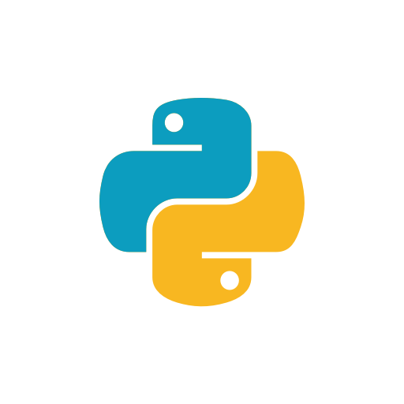

<h1 align="center">

</h1>

## Python 

- Aqui será inserido as informações que foram aprendidas na matéria de Programação Server-Side; 
- A linguagem usada será Python com o framework Flask. 

## 📌 Aula 01

- Programação Server-Side: o que é? quais as vantagens? Quais as desvantagens? Características da programação Server-Side? 

• A programação server-side é a programação do lado do servidor. Refere-se à
prática de escrever código e executar a lógica para um aplicativo ou cliente no
servidor. Nesse método, existem pelo menos 2 papéis, o de cliente e o servidor.

• Uma alternativa para devolver uma página estática ou uma página específica
para um determinado cliente.

• Esse modelo de programação é fundamental em muitos aplicativos web e
sistemas online. Onde o cliente solicita um serviço ao servidor e o servidor
devolve a resposta para o cliente.

#### 😀 Vantagens:

• É possível ter uma camadas de segurança e privacidade mais robustas.
• Velocidade e escalabilidade.
• Omissão da lógica de funcionamento do sistema.
• Interface do cliente mais leves.
• Interoperabilidade.
• Processamento pesado, a manipulação de dados e a interação com bancos de dados
normalmente ocorrem no servidor.

#### 😔 Desvantagens:

• Necessidade de um servidor.
• Necessidade de uma conexão de rede

• O que é um Cliente?
• É um dispositivo de hardware ou software de computador que consome um serviço
disponibilizado por um servidor. 

• O que é um Servidor?
• Um servidor é um computador físico ou um software na nuvem dedicado a executar
serviços para atender às necessidades de outros computadores. O servidor
geralmente (mas nem sempre) está localizado em um computador físico ou uma
nuvem separada.
• Existem diversos serviços, por exemplo: um servidor de arquivos, servidor de
banco de dados, servidor de mídia doméstica, servidor de impressão, servidor da
web, entre outros.

## 📌 Aula 2
Programando já em Python, apresentando a linguagem. 

## 📌 Aula 3
Aprendendo sobre o Flask

#### Métodos HTTP 

• GET: Solicita a representação de um recurso para um servidor. Retornam apenas dados. Pode usar
paginação (fragmenta a resposta em páginas e lê página a página).
  

• POST : Submeter uma entidade a um recurso específico causando uma mudança de estado no recurso
(Envia informações a um servidor, geralmente de formulários).
 

• PUT: Substitui as atuais representações do recurso de destino pela carga de dados da requisição
(edita arquivos já existentes).
 

• DELETE: Remove um recurso específico.
 

• PATCH: Utilizado para aplicar modificações parciais.
 

• HEAD: Solicita uma resposta de forma idêntica ao GET, porém sem conter o corpo da resposta (retorna
apenas o cabeçalho da resposta).

## 📌 Aula 4
- CI/CD é a abreviação de Continuous Integration/Continuous Delivery, ou em português integração e entrega contínuas. É uma prática de desenvolvimento de software que utiliza builds e testes automatizados para tornar a integração de código mais eficiente.

- Facilita a entrega de aplicações com mais frequência. Porém necessita de regras de automação nas etapas de desenvolvimento de apps.

## 📌 Aula 7
• API é a sigla em inglês para Application Programming Interface, ou interface de programação de aplicações.
• APIs são conjuntos de regras, protocolos e ferramentas que permitem que
diferentes aplicativos se comuniquem entre si.
• Em outras palavras, as APIs são interfaces que permitem que dois softwares se integrem e se comuniquem de maneira padronizada e organizada.